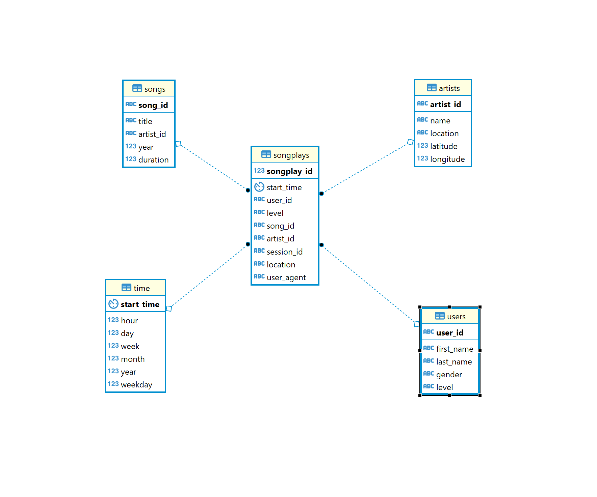

# Udacity Data Engineering Nanodegree - Project 4: Sparkfy Data Lake

## Description

The goal of this project is to create a data lake Sparkify, a music streaming app. The company has first shared their song database and usage log as json files, stored in AWS S3 buckets, that are going to be cleaned and organized in different bucket using a start schema for Sparkfy analysts to query it. 

# Usage

This data Lake (DW) project is implemented using the following services in AWS:
* S3

The file `etl.py` implements the data processing, using PySpark api to read the raw data from S3, creating the dimension tables and the fact table `songplays`.
One thing to notice is that you will need an AWS access key and AWS secret for this key, if you're not sure how to setup this programatic access, please refer to AWS documentation.

In the `dl.cfg` complete the values for the access key and secret to your aws account (remember to never share this information in Github or any other public online page).

After setting up the configuration file, open the terminal and execute the script with the following command `python etl.py`.
## Database design

The database designed implements a star schema, with 1 fact table and 4 dimensions. Our fact table `songplays` is the event of playing a song by any user, meanwhile the dimensions are:
* `users` - Contains user information such as name, gender, and subscription type (paid or free)
* `artists` - Contains artists information such as name, location
* `songs` - Contains songs information such as title, artist id, duration, year
* `time` - Contains timestamp information and its associated data, such as month, week, day, weekday, year, and hour
 

_*Datbase schema close up to final tables.*_


## Sample Query And Sample data
Some sample data is made available for local testing, please refer the `\data` folder.

* Get the top 100 songs listed in a given year and month:

```
SELECT  songs.title,
        artists.name,
        COUNT(songplays.songplay_id) as Playtime,
        "time".year,
        "time".month
FROM songplays JOIN songs ON (songplays.song_id = songs.song_id) JOIN artists ON (songplays.artist_id = artists.artist_id)
JOIN "time" ON (songplays.start_time = "time".start_time)
WHERE "time".year = 2018 /* Put here the desired year*/ AND "time".month = 11 /* Put here the desired month       */
GROUP BY songs.title, artists.name,"time".year,"time".month
ORDER BY (Playtime) DESC
LIMIT 100;
```

